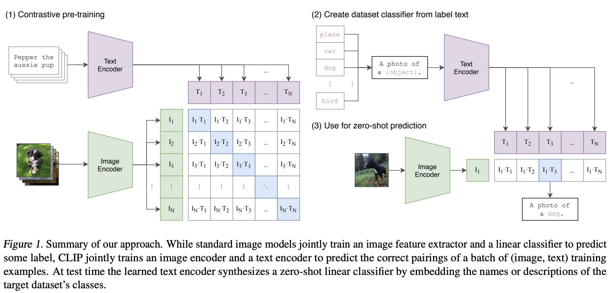
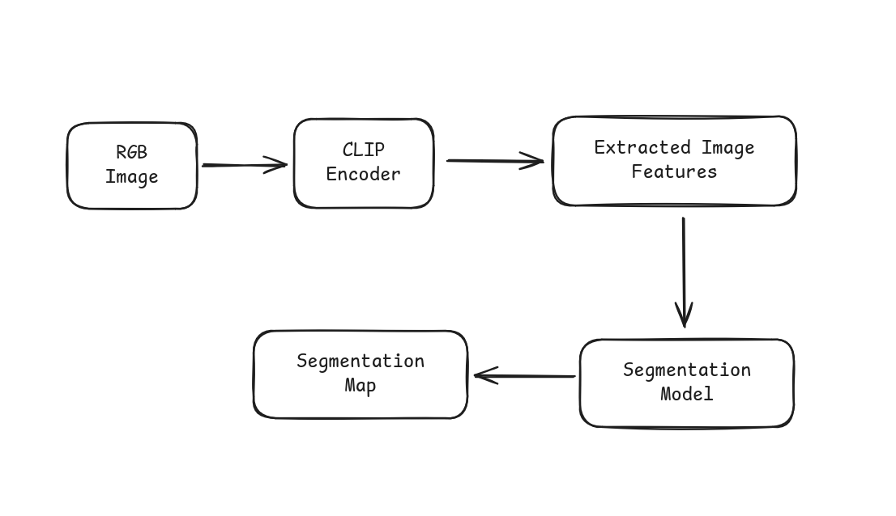

# Overview
This project takes a deep dive into training and comparing the outputs generated by different segmentation models.
<br>
The segmentation models that will be used are:
| Model       | IOU Score | Dice Score |
| :---------- | :-------- | :--------- |
| UNET        | 0.36      | 0.45       |
| Autoencoder | 0.23      | 0.30       |
| CLIP        | 0.55      | 0.61       |
| PointCLIP   | -         | -          |

## What is image segmentation?
[Video Explanation](https://www.youtube.com/watch?v=5QUmlXBb0MY)

In an image, there can be different objects such as the sky, trees and people.

An image segmentation simply divides the image into different regions.

A semantic segmentation gives a class to each pixel in the image.

Take a look at this cat image.
<br>


The semantic mask is as follows.
<br>


| Object       | Semantic Color         |
| ------------ | ---------------------- |
| cat          | red with white outline |
| couch & wall | black                  |
## Setting up the Dataset
The dataset can be found [here](https://uoe-my.sharepoint.com/:u:/g/personal/s2526104_ed_ac_uk/EXBmCQKQ7KdAmOr0P9c1lFwBwYaqySQ1d8gps8I7CcRPnw?e=VBex8K).

## Setting up the Python environment

```py
# creating the environment
pip install virtualenv
cd /Projects/image-segmentation-cv
python3 -m virtualenv env
source env/bin/activate

# installing dependencies
python3 -r requirements.txt

# adding project root to python
export PYTHONPATH="$PYTHONPATH:/path/to/projectroot"
```

### CLIP
The concept is that the pre-trained image encoder in CLIP is trained on a vast dataset which allows it to learn robust visual features. This means the encoder can identify complex patterns that are helpful for segmentation tasks.
<br />

I plan to evaluate the performance of 2 different models.
| Model                    | Reasoning                                                                                   |
| ------------------------ | ------------------------------------------------------------------------------------------- |
| CLIP Encoder + CNN       | encoder contains feature rich information, can be used as a downstream for segmentation map |
| CLIPSegModel (Zero Shot) | already built and can be used directly from huggingface as a baseline                       |




