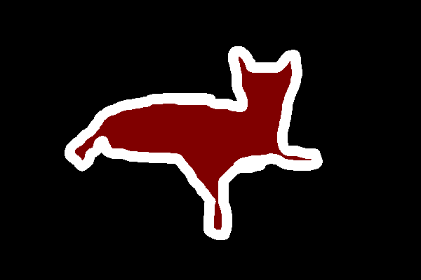

# Overview
This project takes a deep dive into training and comparing the outputs generated by different segmentation models.
<br>
The segmentation models that will be used are:
| Model       | IoU  | Dice | Accuracy |
| :---------- | :--- | :--- | :------- |
| UNET        | 0.36 | 0.45 | 0.82     |
| Autoencoder | 0.23 | 0.30 | 0.77     |
| CLIP        | 0.55 | 0.61 | 0.94     |
| PointCLIP   | 0.37 | 0.53 | 0.56     |

## What is image segmentation?
[Video Explanation](https://www.youtube.com/watch?v=5QUmlXBb0MY)

In an image, there can be different objects such as the sky, trees and people.

An image segmentation simply divides the image into different regions.

A semantic segmentation gives a class to each pixel in the image.

Take a look at this cat image.
<br>


The semantic mask is as follows.
<br>


| Object       | Semantic Color         |
| ------------ | ---------------------- |
| cat          | red with white outline |
| couch & wall | black                  |
## Setting up the Dataset
The dataset can be found [here](https://uoe-my.sharepoint.com/:u:/g/personal/s2526104_ed_ac_uk/EXBmCQKQ7KdAmOr0P9c1lFwBwYaqySQ1d8gps8I7CcRPnw?e=VBex8K).

## Setting up the Python environment

```py
# creating the environment
git clone https://github.com/yuhaopro/image-segmentation-cv.git

# installing dependencies
python3 -r requirements.txt

# adding project root to python
export PYTHONPATH="$PYTHONPATH:/path/to/projectroot"

# explore each model and run their test script
python3 clip/test.py
```


