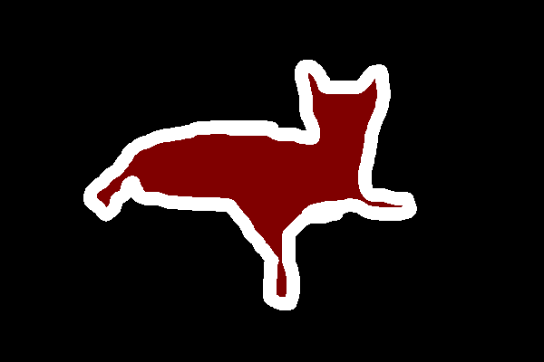

# Overview
This project takes a deep dive into training and comparing the outputs generated by different segmentation models.
<br>
The segmentation models that will be used are:
| Model    | Performance |
| -------- | ------- |
| UNET  | -    |
| Autoencoder | -     |
| CLIP    | -    |
| Prompt-based    | -    |

## What is image segmentation?
[Video Explanation](https://www.youtube.com/watch?v=5QUmlXBb0MY)

In an image, there can be different objects such as the sky, trees and people.

An image segmentation simply divides the image into different regions.

A semantic segmentation gives a class to each pixel in the image.

Take a look at this cat image.
<br>


The semantic mask is as follows.
<br>


| Object    | Semantic Color |
| -------- | ------- |
| cat  | red with white outline   |
| couch & wall | black     |
## Setting up the Dataset
The dataset can be found [here](https://uoe-my.sharepoint.com/:u:/g/personal/s2526104_ed_ac_uk/EXBmCQKQ7KdAmOr0P9c1lFwBwYaqySQ1d8gps8I7CcRPnw?e=VBex8K).

This dataset is a multipart archive so it cannot be unzipped with `unzip` if you are using linux.

### Linux
1. install 7zip
```
sudo apt install p7zip-full
```
2. unzip using 7z
```
7z x Dataset.zip
```
### Windows
1. Download 7zip or use Windows built in archive tool
2. Extract the `Dataset.zip` file into your project directory using the GUI.
## Model Training
We will be performing supervised training on the models to allow them to extract the features from the image and correctly map the objects to their semantic classes (colors).


